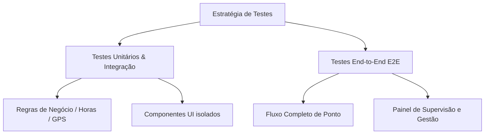

# Especificações de Testes de Front-End — Controle de Estagiário

Este documento define as especificações, estratégias e cenários de testes recomendados para o front-end do projeto **Controle de Estagiário (Porto Terapia)**. O objetivo é assegurar o correto funcionamento das regras de negócio (Lei do Estágio), a validação por geolocalização (GPS) e a segurança de acesso à área de supervisão.

---

## 1. Estratégia de Testes

Para garantir a qualidade e estabilidade da aplicação sem sobrecarregar a manutenção, recomenda-se uma abordagem híbrida dividida em duas camadas principais:



### 1.1. Testes Unitários e de Integração
* **Objetivo:** Validar funções utilitárias e comportamento isolado de componentes.
* **Ferramentas Recomendadas:** [Vitest](https://vitest.dev/) + [React Testing Library](https://testing-library.com/docs/react-testing-library/intro/).
* **Foco:**
  - Cálculo de distância via fórmula de Haversine (validação de raio de 1 km).
  - Validação de limites da Lei do Estágio (6h/dia e 30h/semana).
  - Formatação e máscara de dados (PIN, datas, horas).

### 1.2. Testes End-to-End (E2E)
* **Objetivo:** Simular a jornada real do usuário (estagiários e supervisores) interagindo com a interface gráfica e o banco de dados (Firebase/Supabase).
* **Ferramentas Recomendadas:** [Playwright](https://playwright.dev/) ou [Cypress](https://www.cypress.io/).
* **Foco:**
  - Fluxo completo de batida de ponto (Entrada/Saída) com mock de geolocalização.
  - Acesso ao painel do supervisor utilizando o PIN `1234`.
  - Cadastro, edição e exclusão de estagiários.
  - Ajuste manual e calibração de coordenadas das unidades.

---

## 2. Cenários de Teste Detalhados

Abaixo estão descritos os principais casos de teste estruturados por área funcional do sistema:

### 2.1. Fluxo de Batida de Ponto (Estagiário)

| ID | Cenário | Passos | Resultado Esperado |
| :--- | :--- | :--- | :--- |
| **CT-01** | Batida de ponto dentro do raio permitido (1 km) | 1. Selecionar o estagiário.<br>2. Selecionar a unidade padrão.<br>3. Clicar em "Registrar Entrada".<br>4. Permitir acesso ao GPS (simulado a <1 km). | Ponto registrado com sucesso; exibição do comprovante e persistência no banco. |
| **CT-02** | Bloqueio de batida fora do raio permitido | 1. Selecionar o estagiário.<br>2. Selecionar a unidade padrão.<br>3. Clicar em "Registrar Entrada".<br>4. Simular GPS a >1 km de distância. | Exibição de mensagem de erro informando que o usuário está fora do raio permitido da clínica. Ponto não registrado. |
| **CT-03** | Recusa de permissão de GPS | 1. Tentar bater ponto.<br>2. Negar a permissão de geolocalização no navegador. | Exibição de alerta solicitando ativação do GPS para prosseguir. |
| **CT-04** | Alternância Entrada/Saída automática | 1. Estagiário sem registros hoje acessa a tela. | O botão padrão deve ser "Registrar Entrada". Após a entrada, ao carregar o nome novamente, deve sugerir "Registrar Saída". |

### 2.2. Área de Supervisão e Gestão

| ID | Cenário | Passos | Resultado Esperado |
| :--- | :--- | :--- | :--- |
| **SUP-01** | Autenticação com PIN Correto | 1. Clicar no ícone de escudo.<br>2. Digitar o PIN `1234`. | Acesso concedido; exibição do painel administrativo. |
| **SUP-02** | Bloqueio com PIN Incorreto | 1. Clicar no ícone de escudo.<br>2. Digitar um PIN inválido (ex: `9999`). | Mensagem de erro de autenticação; permanência na tela inicial. |
| **SUP-03** | CRUD de Estagiário | 1. Entrar no Painel.<br>2. Adicionar novo estagiário.<br>3. Editar dados do estagiário.<br>4. Excluir estagiário. | As ações devem atualizar a interface em tempo real e persistir no Firestore. |
| **SUP-04** | Calibração de Localização da Unidade | 1. Entrar no Painel.<br>2. Clicar em "Calibrar com minha localização". | Atualização das coordenadas geográficas (Latitude/Longitude) da unidade ativa no banco. |

### 2.3. Regras Trabalhistas (Lei do Estágio)

| ID | Cenário | Passos | Resultado Esperado |
| :--- | :--- | :--- | :--- |
| **LEI-01** | Alerta de jornada excedida (Diária) | 1. Simular jornada diária > 6 horas para um estagiário. | Exibição de indicador visual/alerta (ex: cor vermelha ou tag de atenção) no relatório de horas. |
| **LEI-02** | Alerta de jornada excedida (Semanal) | 1. Simular carga horária semanal acumulada > 30 horas. | Exibição de alerta no painel de acompanhamento do supervisor. |

### 2.4. Integrações com IA (Gemini - Opcional)

| ID | Cenário | Passos | Resultado Esperado |
| :--- | :--- | :--- | :--- |
| **IA-01** | Análise de Frequência | 1. Acessar o painel do supervisor.<br>2. Clicar em "✨ Analisar Frequências" (com chave configurada). | Exibição de um relatório textual estruturado gerado pela IA com insights de faltas/atrasos. |
| **IA-02** | Comportamento sem Chave de API | 1. Executar a aplicação sem `VITE_GEMINI_API_KEY` no `.env`. | Botões de IA devem ficar desabilitados ou tratar graciosamente a ausência da chave informando o usuário. |

---

## 3. Configuração Técnica Sugerida

Para implementar estes testes no ambiente React + Vite do projeto, sugere-se a seguinte estrutura e passos básicos de setup:

### 3.1. Setup Vitest & React Testing Library (Unitário/Integração)

Instalação das dependências de desenvolvimento:
```bash
npm install -D vitest @testing-library/react @testing-library/jest-dom @testing-library/user-event jsdom
```

Atualização do arquivo [vite.config.js](file:///c:/Users/bruno/Downloads/Controle%20de%20Estagiario/vite.config.js):
```javascript
import { defineConfig } from 'vite'
import react from '@vitejs/plugin-react'

export default defineConfig({
  plugins: [react()],
  test: {
    globals: true,
    environment: 'jsdom',
    setupFiles: './src/setupTests.js',
  },
})
```

### 3.2. Setup Playwright (E2E)

Instalação do Playwright:
```bash
npm init playwright@latest
```
*Durante o setup, escolha JavaScript/TypeScript, o diretório de testes (`tests/`) e adicione uma ação no GitHub Actions (opcional).*

#### Exemplo de Teste de GPS Mockado com Playwright (`tests/ponto.spec.js`):
```javascript
const { test, expect } = require('@playwright/test');

test('Deve permitir bater ponto quando dentro do raio de 1km', async ({ page, context }) => {
  // Configura a localização do navegador simulando a unidade Antônio Barreto
  await context.grantPermissions(['geolocation']);
  await context.setGeolocation({ latitude: -1.4550, longitude: -48.4790 }); // Exemplo

  await page.goto('http://localhost:5173');
  
  // Interage com a página de batida de ponto
  await page.selectOption('#select-estagiario', { label: 'João Silva' });
  await page.click('button:has-text("Registrar Entrada")');
  
  // Confirmação
  await expect(page.locator('.text-success')).toBeVisible();
});
```

---
*Documento elaborado para fins de estruturação e garantia de qualidade do software Controle de Estagiário — Porto Terapia.*
