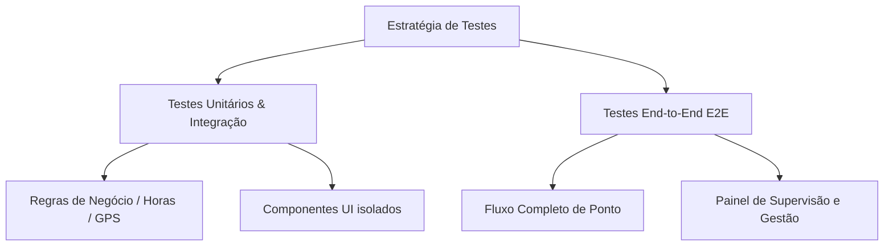

# Especificações de Testes de Front-End — Controle de Estagiário

Este documento define as especificações, estratégias e cenários de testes recomendados para o front-end do projeto **Controle de Estagiário (Porto Terapia)**. O objetivo é assegurar o correto funcionamento das regras de negócio (Lei do Estágio), a validação por geolocalização (GPS) e a segurança de acesso à área de supervisão.

---

## 1. Estratégia de Testes

Para garantir a qualidade e estabilidade da aplicação sem sobrecarregar a manutenção, recomenda-se uma abordagem híbrida dividida em duas camadas principais:



### 1.1. Testes Unitários e de Integração
* **Objetivo:** Validar funções utilitárias e comportamento isolado de componentes.
* **Ferramentas Recomendadas:** [Vitest](https://vitest.dev/) + [React Testing Library](https://testing-library.com/docs/react-testing-library/intro/).
* **Foco:**
  - Cálculo de distância via fórmula de Haversine (validação do raio de 100 m / 0.1 km).
  - Validação de limites da Lei do Estágio (6h/dia e 30h/semana).
  - Formatação e máscara de dados (datas, horas, CPF, etc.).

### 1.2. Testes End-to-End (E2E)
* **Objetivo:** Simular a jornada real do usuário (estagiários e supervisores) interagindo com a interface gráfica e o banco de dados (Supabase).
* **Ferramentas Recomendadas:** [Playwright](https://playwright.dev/) ou [Cypress](https://www.cypress.io/).
* **Foco:**
  - Fluxo completo de batida de ponto (Entrada/Saída) com mock de geolocalização.
  - Acesso ao painel do supervisor utilizando credenciais do Supabase (`supervisor@portoterapia.com`).
  - Cadastro, edição e exclusão de estagiários.
  - Ajuste manual e calibração de coordenadas das unidades.

---

## 2. Cenários de Teste Detalhados

Abaixo estão descritos os principais casos de teste estruturados por área funcional do sistema:

### 2.1. Fluxo de Batida de Ponto (Estagiário)

| ID | Cenário | Passos | Resultado Esperado |
| :--- | :--- | :--- | :--- |
| **CT-01** | Batida de ponto dentro do raio permitido (100 m) | 1. Autenticar como estagiário/unidade.<br>2. Clicar em "Registrar Entrada".<br>3. Permitir acesso ao GPS (simulado a <100 m). | Ponto registrado com sucesso; exibição do comprovante e persistência no banco. |
| **CT-02** | Bloqueio de batida fora do raio permitido | 1. Autenticar como estagiário/unidade.<br>2. Clicar em "Registrar Entrada".<br>3. Simular GPS a >100 m de distância. | Exibição de mensagem de erro informando que o usuário está fora do raio permitido da clínica. Ponto não registrado. |
| **CT-03** | Recusa de permissão de GPS | 1. Tentar bater ponto.<br>2. Negar a permissão de geolocalização no navegador. | Exibição de alerta solicitando ativação do GPS para prosseguir. |
| **CT-04** | Alternância Entrada/Saída automática | 1. Estagiário sem registros hoje acessa a tela. | O botão padrão deve ser "Registrar Entrada". Após a entrada, ao carregar a tela novamente, deve sugerir "Registrar Saída". |
| **CT-05** | Cadastro Obrigatório de Estagiário (Autocadastro) | 1. Na tela inicial/login, clicar no botão de "Recadastro / Novo Cadastro".<br>2. Preencher todos os campos obrigatórios (Nome, CPF válido, RG, Turno, etc.).<br>3. Capturar/enviar foto e anexar os documentos obrigatórios (CPF/RG e Comprovante de Matrícula).<br>4. Submeter o cadastro. | Cadastro realizado com sucesso; dados salvos na tabela `interns` do Supabase e usuário autenticável criado com senha provisória padrão `0000`. |


### 2.2. Área de Supervisão e Gestão

| ID | Cenário | Passos | Resultado Esperado |
| :--- | :--- | :--- | :--- |
| **SUP-01** | Autenticação com Credenciais Corretas | 1. Selecionar "Supervisor" na tela de login.<br>2. Digitar o email `supervisor@portoterapia.com` e senha `admin123`. | Acesso concedido; exibição do painel administrativo. |
| **SUP-02** | Bloqueio com Credenciais Incorretas | 1. Selecionar "Supervisor" na tela de login.<br>2. Digitar credenciais inválidas. | Mensagem de erro de autenticação; permanência na tela de login. |
| **SUP-03** | CRUD de Estagiário | 1. Entrar no Painel.<br>2. Adicionar novo estagiário.<br>3. Editar dados do estagiário.<br>4. Excluir estagiário. | As ações devem atualizar a interface em tempo real e persistir no Supabase. |
| **SUP-04** | Calibração de Localização da Unidade | 1. Entrar no Painel.<br>2. Clicar em "Calibrar com minha localização". | Atualização das coordenadas geográficas (Latitude/Longitude) da unidade ativa no banco. |

### 2.3. Regras Trabalhistas (Lei do Estágio)

| ID | Cenário | Passos | Resultado Esperado |
| :--- | :--- | :--- | :--- |
| **LEI-01** | Alerta de jornada excedida (Diária) | 1. Simular jornada diária > 6 horas para um estagiário. | Exibição de indicador visual/alerta (ex: cor vermelha ou tag de atenção) no relatório de horas. |
| **LEI-02** | Alerta de jornada excedida (Semanal) | 1. Simular carga horária semanal acumulada > 30 horas. | Exibição de alerta no painel de acompanhamento do supervisor. |

### 2.4. Integrações com IA (Gemini - Opcional)

| ID | Cenário | Passos | Resultado Esperado |
| :--- | :--- | :--- | :--- |
| **IA-01** | Análise de Frequência | 1. Acessar o painel do supervisor.<br>2. Clicar em "✨ Analisar Frequências" (com chave configurada). | Exibição de um relatório textual estruturado gerado pela IA com insights de faltas/atrasos. |
| **IA-02** | Comportamento sem Chave de API | 1. Executar a aplicação sem `VITE_GEMINI_API_KEY` no `.env`. | Botões de IA devem ficar desabilitados ou tratar graciosamente a ausência da chave informando o usuário. |

### 2.5. Controle de Biometria Facial

| ID | Cenário | Passos | Resultado Esperado |
| :--- | :--- | :--- | :--- |
| **BIO-01** | Comparação de Foto de Cadastro com Biometria do Ponto | 1. Entrar no Painel do Supervisor com credenciais administrativas.<br>2. Ir para o histórico de registros.<br>3. Identificar um registro de ponto e clicar para abrir a imagem/biometria. | O modal de visualização deve abrir exibindo lado a lado a "Foto do Cadastro (Inicial 3x4)" e a "Biometria do Ponto (Registro)" para fins de comparação de identidade. |
| **BIO-02** | Alerta de Estagiário Sem Foto de Cadastro | 1. Entrar no Painel do Supervisor.<br>2. Clicar na biometria de um ponto de estagiário que não cadastrou foto 3x4. | Exibição de alerta informativo indicando "Estagiário sem foto 3x4 cadastrada para comparação". |


---

## 3. Configuração Técnica Sugerida

Para implementar estes testes no ambiente React + Vite do projeto, sugere-se a seguinte estrutura e passos básicos de setup:

### 3.1. Setup Vitest & React Testing Library (Unitário/Integração)

Instalação das dependências de desenvolvimento:
```bash
npm install -D vitest @testing-library/react @testing-library/jest-dom @testing-library/user-event jsdom
```

Atualização do arquivo [vite.config.js](file:///c:/Users/bruno/Downloads/Controle%20de%20Estagiario/vite.config.js):
```javascript
import { defineConfig } from 'vite'
import react from '@vitejs/plugin-react'

export default defineConfig({
  plugins: [react()],
  test: {
    globals: true,
    environment: 'jsdom',
    setupFiles: './src/setupTests.js',
  },
})
```

### 3.2. Setup Playwright (E2E)

Instalação do Playwright:
```bash
npm init playwright@latest
```
*Durante o setup, escolha JavaScript/TypeScript, o diretório de testes (`tests/`) e adicione uma ação no GitHub Actions (opcional).*

#### Exemplo de Teste de GPS Mockado com Playwright (`tests/ponto.spec.js`):
```javascript
const { test, expect } = require('@playwright/test');

test('Deve permitir bater ponto quando dentro do raio de 100m', async ({ page, context }) => {
  // Configura a localização do navegador simulando a unidade Antônio Barreto
  await context.grantPermissions(['geolocation']);
  // Coordenadas reais da Unidade Antônio Barreto
  await context.setGeolocation({ latitude: -1.44247, longitude: -48.46999 });

  await page.goto('http://localhost:5173');
  
  // Realiza o login como estagiário/unidade e interage com a página de batida de ponto
  await page.fill('#username', 'teste.estagio');
  await page.fill('#password', '0000');
  await page.click('button:has-text("Entrar")');
  
  await page.click('button:has-text("Registrar Entrada")');
  
  // Confirmação
  await expect(page.locator('.text-success')).toBeVisible();
});

test('Deve permitir o autocadastro obrigatório preenchendo todos os dados e enviando os documentos', async ({ page }) => {
  await page.goto('http://localhost:5173');
  
  // Clica no botão para iniciar o fluxo de cadastro obrigatório/recadastro
  await page.click('button:has-text("Recadastro")');
  
  // Preenche dados pessoais e acadêmicos obrigatórios
  await page.fill('input[placeholder*="Nome"]', 'Novo Estagiário de Teste');
  await page.fill('input[placeholder*="CPF"]', '05437812900'); // CPF válido para passar no validador
  await page.fill('input[placeholder*="Email"]', 'teste.novo@portoterapia.com');
  await page.fill('input[placeholder*="RG"]', '9876543 SSP/PA');
  await page.fill('input[placeholder*="Telefone"]', '(91) 99999-9999');
  await page.fill('input[placeholder*="Curso"]', 'Psicologia');
  await page.fill('input[placeholder*="Instituição"]', 'UFPA');
  await page.fill('input[placeholder*="Endereço"]', 'Avenida Nazaré, 100 - Belém');
  
  // Preenche dados bancários e contato de emergência
  await page.fill('input[placeholder*="Banco"]', 'Banco do Brasil');
  await page.fill('input[placeholder*="Agência"]', '1234');
  await page.fill('input[placeholder*="Conta"]', '56789-0');
  await page.fill('input[placeholder*="PIX"]', 'teste.novo@portoterapia.com');
  await page.fill('input[placeholder*="Contato de Emergência"]', 'Maria de Sousa');
  await page.fill('input[placeholder*="Telefone de Emergência"]', '(91) 98888-8888');
  
  // Simula o upload de documentos obrigatórios (CPF/RG e Comprovante de Matrícula)
  const fileChooserPromise1 = page.waitForEvent('filechooser');
  await page.click('button:has-text("Anexar CPF/RG")');
  const fileChooser1 = await fileChooserPromise1;
  await fileChooser1.setFiles('./tests/fixtures/documento_dummy.pdf');
  
  const fileChooserPromise2 = page.waitForEvent('filechooser');
  await page.click('button:has-text("Anexar Matrícula")');
  const fileChooser2 = await fileChooserPromise2;
  await fileChooser2.setFiles('./tests/fixtures/documento_dummy.pdf');
  
  // Clica no botão de envio
  await page.click('button:has-text("Salvar Cadastro")');
  
  // Verifica mensagem de sucesso ou redirecionamento
  await expect(page.locator('text=Cadastro realizado com sucesso')).toBeVisible();
});

test('Deve exibir modal de biometria comparando a foto 3x4 do cadastro com a foto do ponto', async ({ page }) => {
  // Login como supervisor
  await page.goto('http://localhost:5173');
  await page.click('button:has-text("Supervisor")');
  await page.fill('#username', 'supervisor@portoterapia.com');
  await page.fill('#password', 'admin123');
  await page.click('button:has-text("Entrar")');

  // Acessa o histórico e clica para ver a biometria/foto do registro
  await page.click('button:has-text("Frequência")');
  await page.click('img[title*="biometria"], button:has-text("Ver Foto")');

  // Valida que o modal de comparação foi aberto
  await expect(page.locator('text=Biometria de Reconhecimento')).toBeVisible();
  
  // Valida a presença da foto de cadastro e a foto do ponto
  await expect(page.locator('text=Foto do Cadastro (Inicial 3x4)')).toBeVisible();
  await expect(page.locator('text=Biometria do Ponto (Registro)')).toBeVisible();
});
```


---
*Documento elaborado para fins de estruturação e garantia de qualidade do software Controle de Estagiário — Porto Terapia.*
